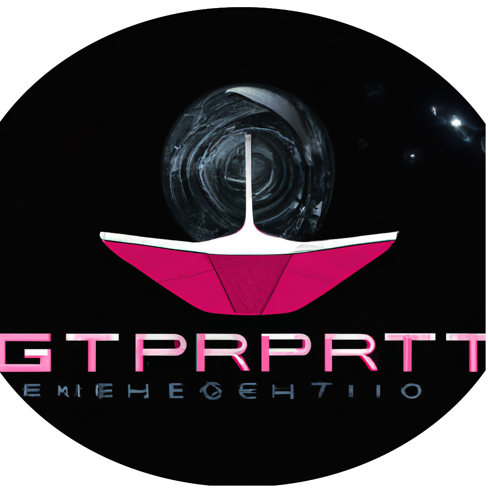

<h1 align="center">
GPTenterprise :zzz: :robot:
</h1>
<h1 align="center">

</h1>

[](https://www.python.org)
[](https://www.openai.com)
[](https://img.shields.io/badge)

First try on emulating an enterprise with OpenaAI GPT.

This is basically a python package emulating an enterprise. It requests OpenaAI API and generate a sequence of task with a variety of system prompts to tell GPT what employee to be :brain:.

## :artificial_satellite: About the enterprise (by GPT)
<p>Our innovative company uses advanced artificial intelligence technology to bring products and services to the next level. Our employees are AI instances created with the powerful GPT language model that can perform various roles like engineers, designers, and even marketers. This enables us to develop products faster and more efficiently than traditional companies while also providing a unique experience for our customers.</p>
		
		
<p>Our AI employees are equipped with the latest technology and are constantly learning and adapting to new situations. This allows us to be more agile and responsive to market changes, ensuring that our products and services are always at the forefront of innovation.</p>
		
<p>If you're interested in experiencing the future of AI technology, check out our product.</p>

<p>Disclaimer: Our AI employees are not intended to replace human workers and are designed to be used as a supplement to human teams. We believe in the power of human creativity and intelligence when combined with advanced technology.</p>

## :pinched_fingers: Requirements

- Python 3.7 or newer

- [Open API key](https://platform.openai.com/account/api-keys)

## :surfing_woman: Installation
1 - Clone this repository
```bash
git clone https://github.com/nervousapps/GPTenterprise.git
```

2 - Go in the repo directory
```bash
cd GPTenterprise
```

3 - A python venv is recommended, to create one, in your terminal:
```bash
python3 -m venv gptenterprise
```
And enable it
```bash
source ./gptenterprise/bin/activate
```

4 - Install GPTenterprise package and dependencies by executing:
```bash
pip install ./python
```

## :unicorn: OpenAI key configuration
- Fill openai_key.txt.template with your opanai key and rename it to openai_key.txt. Or create a new one using:
```bash
nano ./openai_key.txt
```


## :point_right: Quickstart v1
To see an example of what can be done with the idea of GPTenterprise, tweek config file in order to give :superhero_man: CEO guidelines (and other parameters if you want but default one should be ok), and run:
```bash
GPTenterprise ./config
```

Then the enterprise will be created with your guidelines and a manager will be hired. He will do his best to achieve guidelines.
The manager will make a plan, with all employees to hire and the sequences of tasks that will be executed to produce the wondered result.

## Documentation

[HTML documentation here](https://github.com/nervousapps/GPTenterprise/tree/master/html/gpt_enterprise).

The manager prompt defines the object structure for employees, tasks and global object. These structures must not be changed as they are used in the code.

Employee structure
```python
{
    "name": "Employee's name",
    "role_name": "Employee's role name",
    "role": "Employee's role (system prompt)"
    "creativity": 1.0
    "emoji": "Emoji code"
}
```
Name and role_name must be unique.

Task structure
```python
{
    "task_name":
    "employee":
    "todo":
    "type":
    "requirements": '("yes" or "no")'
}
```
At each task, the manager will add a result field with the employee's work.

Plans structure
```python
{
    "employees": [employee1, employee2],
    "tasks": [task1, task2],
}
```

The final product can be found in the final_product field of the json object contained in "production_<company_name>.json" file in the specified output directory.


### Environement variables (config file)
| env name                       | description     | default value      |
| -------------------------------| ----------------| -------------------|
| COMPANY_NAME                   | Enterprise name                                                       | GPTenterprise   | 
| KEYFILE                        | Path to openai keyfile.txt                                            | ./openai_key.txt|
| OUTPUT_DIRECTORY               | Output directory                                                      | ./generated/v2  |
| MANAGER_RETRY                  | How many times manager will retry to do the plans if failing          | 1               |
| CUSTOM_MANAGER_PROMPTS_PATH    | Give a custom manager prompt (be careful to keep objects structure definitions) | ""              |
| CEO_GUIDELINES                 | "As a CEO, I want ..."                                         | "As a CEO, I want ..." |
| INTERACTIVE                    | Wait for uer entry (basic for now)                                        | "no" |

## Tests
1 - Install tests requirements
```bash
pip install -r ./python/requirements-tests.txt
```

2 - Run tests
```bash
pytest
```

## Going further
- rework manager prompt
- enhanced employees interactions
- asynchronous operations
- multi managers enterprise
- keep previous responses in memory
- internet search (python only to avoid using openAI's token)


## :raccoon: Miscelleneous
### :older_woman: Quickstart POC

To see an example of what can be done with the idea of GPTenterprise, let use the webgpt.py

WebGPT is an AI driven enterprise that develop website for its clients.

It is composed of several GPT employees (prompts):
    
- :writing_hand: a subject prompter, that is responsible of formulating subjects.

- :camera_flash: a dall-e prompter, that is responsible of generating prompts to inject to dall-e for generating images on the previously generated sibject.

- :desktop_computer: a web developer, that is responsible of coding the website on previously generated subject and images.

- :superhero_man: a CEO (you), that is responsible of driving all of this and run the enterprise.

To run the enterprise please do:
```bash
python ./examples/webgpt.py
```